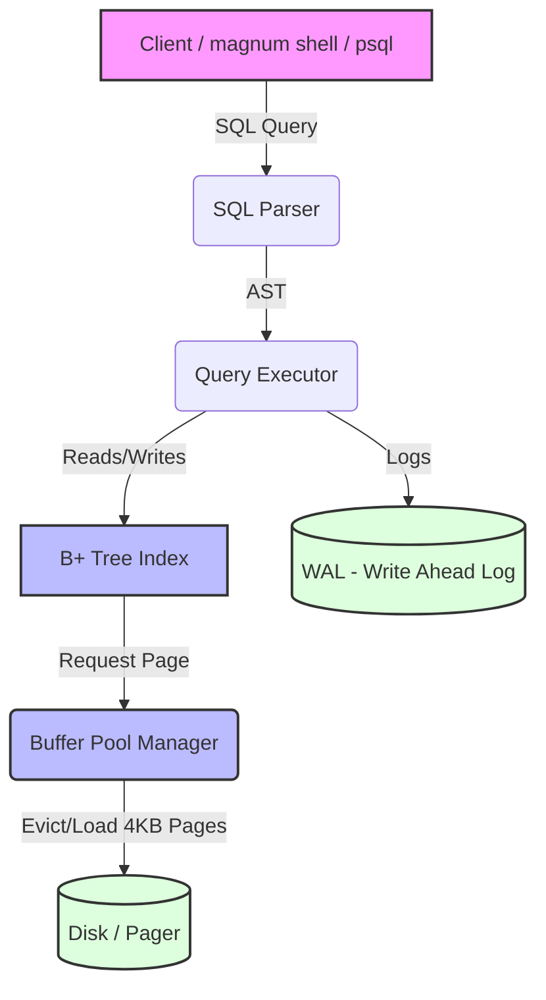

# MagnumDB

> Modern Open Source Embedded Database Engine in Native Rust

[](https://github.com/sohamdev77/MagnumDB/actions)
[](https://opensource.org/licenses/MIT)
[](https://www.rust-lang.org/)
[](https://crates.io/crates/magnumdb)
[](https://docs.rs/magnumdb)
[](https://github.com/sohamdev77/MagnumDB/stargazers)
[](https://github.com/sohamdev77/MagnumDB/issues)

MagnumDB is an open-source embedded key-value and SQL database engine written 100% from scratch in native Rust. Designed for performance, reliability, and modularity.

## Features

- **Embedded Engine**: Runs directly inside Rust binaries with zero external C/C++ dependencies.
- **WAL Durability**: Write-Ahead Logging (WAL) with TxID framing and CRC32 checksums ensures crash recovery.
- **B+ Tree Indexing**: Custom 4KB page disk pager, LRU buffer pool management, overflow pages, and leaf page recycling.
- **Relational SQL Query Engine**: Hash JOINs (`INNER JOIN`, `LEFT JOIN`), `GROUP BY` & `HAVING` aggregations, `ORDER BY` sorting, `LIMIT` & `OFFSET` pagination, and composite indexes.
- **MVCC & Transactions**: MVCC row headers (`xmin`, `xmax`) and transaction logging with `BEGIN`, `COMMIT`, and `ROLLBACK`.
- **PostgreSQL Protocol & Extended Querying**: Native PostgreSQL Wire Protocol (`pgwire`) supporting prepared statements and `$1`, `$2` parameter binding (`Parse`, `Bind`, `Execute`).
- **Multi-Client TCP Server**: Async TCP server powered by Tokio with connection limits and idle timeouts.

---

## What's New in v0.4.0

Version `0.4.0` expands SQL ordering, pagination, and ORM parameter binding:

- ↕️ **`ORDER BY` Sorting (`SortExec`)**: Sort query results by numeric or text columns in ascending or descending order:
  ```sql
  SELECT * FROM users ORDER BY age DESC;
  ```
- 📄 **`LIMIT` & `OFFSET` Pagination (`LimitOffsetExec`)**: Skip offset rows and cap max result rows:
  ```sql
  SELECT * FROM users ORDER BY age DESC LIMIT 10 OFFSET 5;
  ```
- 📝 **Extended PostgreSQL Protocol ($1 Parameter Binding)**: Server handles prepared statements (`Parse` 'P', `Bind` 'B', `Execute` 'E') with `$1, $2` parameter substitution for ORMs.

---

## Architecture



---

## Installation

Add MagnumDB to your `Cargo.toml`:

```toml
[dependencies]
magnumdb = "0.4.0"
```

---

## Quick Start (Embedded Key-Value)

```rust
use magnumdb::{Database, Config};

fn main() -> anyhow::Result<()> {
    let config = Config::default().with_path("./my_database");
    let mut db = Database::open(config)?;

    // Embedded Key-Value API
    db.put(b"user:100", b"Soham")?;
    let val = db.get(b"user:100")?;
    
    if let Some(bytes) = val {
        println!("Found: {}", String::from_utf8_lossy(&bytes));
    }

    db.close()?;
    Ok(())
}
```

---

## Embedded SQL Usage

```rust
use magnumdb::{Database, Config};
use magnumdb::sql::{Executor, Parser};

fn main() -> anyhow::Result<()> {
    let config = Config::default().with_path("./sql_data");
    let mut db = Database::open(config)?;
    let mut exec = Executor::new(&mut db);

    exec.execute(Parser::parse("CREATE TABLE users(id INT, name TEXT)")?)?;
    exec.execute(Parser::parse("INSERT INTO users VALUES(1, 'Alice')")?)?;
    
    let res = exec.execute(Parser::parse("SELECT * FROM users ORDER BY id DESC LIMIT 5")?)?;
    println!("{}", res);

    Ok(())
}
```

---

## Contributing & License

We welcome contributions! Please review [CONTRIBUTING.md](CONTRIBUTING.md).

Licensed under the [MIT License](LICENSE).
